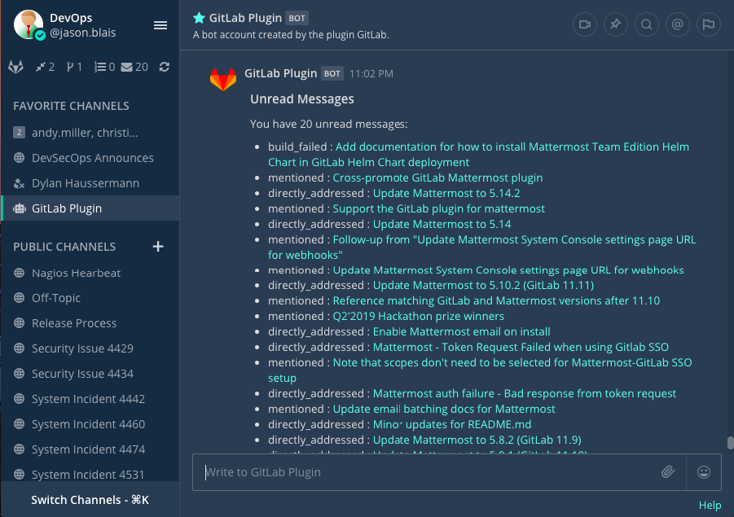

# Feature Summary

## GitLab to Mattermost Notifications

### Channel Subscriptions

Notify your team of the latest updates by sending notifications from your GitLab group or repository to Mattermost channels.  When team members log in the first time to Mattermost each day, they can get a post letting them know what issues and merge requests need their attention. They can also get a refresh of new events by clicking on *Refresh* and from every webhook configured in GitLab.

You can specify which events trigger a notification. They can see:

- issues - includes new and closed issues
- merges - includes new and closed merge requests
- pushes - includes pushes
- issue_comments - includes new issue comments
- merge_request_comments - include new merge-request comments
- pipeline - include pipeline
- tag - include tag creation
- pull_reviews - includes merge request reviews
- label:"<labelname>" - must include "merges" or "issues" in feature list when using a label
- Defaults to "merges,issues,tag"

### Personal Notifications: GitLab Bot

Each user in Mattermost is connected with their own personal GitLab account. Users can get a direct message in Mattermost when someone mentions them, requests their review, comments on, or modifies one of their merge requests/issues, or assigns them on GitLab.

### Sidebar Buttons

Team members can stay up-to-date with how many reviews, todos, assigned issues, and assigned merge requests they have by using buttons in the Mattermost sidebar.

## Mattermost Commands

Interact with the GitLab plugin using the `/gitlab` slash command.

### Subscribe To/Unsubscribe From a Repository

Use `/gitlab subscriptions add owner[/repo] [features]` to subscribe a Mattermost channel to receive posts for new merge requests and/or issues, or other features (as listed above), from a GitLab repository. Ensure that the webhook is configured, otherwise this will not work properly.

Use `/gitlab subscriptions delete owner/repo` to unsubscribe from it.  

`/gitlab subscriptions list` lists what you have subscribed to.

### Connect To/Disconnect From GitLab

Connect your Mattermost account to your GitLab account using `/gitlab connect` and disconnect it using`/gitlab disconnect`. 

`/gitlab me` displays the connected GitLab account.

### Get "To Do" Items

Use `/gitlab todo` to get a list of todos, assigned issues, assigned merge requests and merge requests awaiting your review.

### Update Settings

Use `/gitlab settings [setting] [value]` to update your settings for the plugin.  There are two settings:

- To turn **personal notifications** `on` or `off.
- To turn **reminders** `on` or `off` for when you connect for the first time each day.  

### And More...

Run `/gitlab help` to see what else the slash command can do.

## *Don't forget to add a webhook in GitLab*

See [Configuration](setup/configuration.md)
